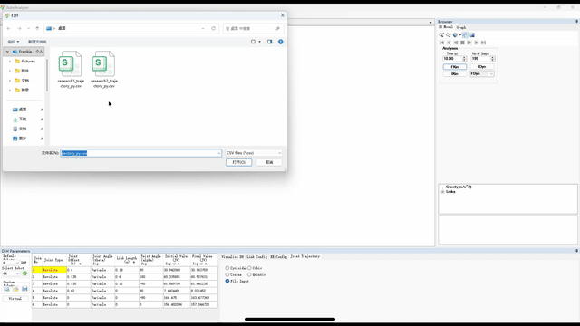
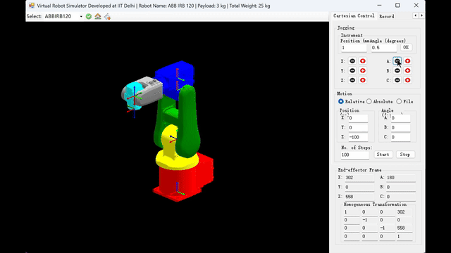

# WHUBot — 轨迹生成与仿真工具

## ✨ 1. 介绍
本项目用 Python 完成轨迹生成流程，目标是：
- 从文本或向量轮廓生成机器人轨迹（带升降避让、插值平滑）；
- 导出 CSV 用于下游机器人控制器加载与回放；
- 支持可配置的渲染、轮廓提取与路径后处理参数，便于调优与复现实验。

## 🛠️ 2. 环境配置
建议使用 conda 管理环境，仓库包含 `environment.yml`（可复现的 Python 包依赖）。

示例：
```bash
# 从 environment.yml 创建环境（例如名为 bot）
conda env create -f environment.yml -n bot
conda activate robot
```

必要包（示例）：Python 3.10, numpy, scipy, matplotlib, pillow, scikit-image。

## ▶️ 3. 快速启动与运行
- 生成 research1 的轨迹：
```bash
python src/runner/research1.py --config configs/research1_config.yaml
```
- 生成 research2（文本→轨迹）：
```bash
python src/runner/research2.py --config configs/research2_config.yaml
```

运行后会在控制台输出日志，出现错误时检查配置文件中字体路径、渲染 DPI 等参数。

## ▶️ 示例演示（可视化回放）

<div style="display:flex; flex-wrap:wrap; gap:20px; justify-content:center; align-items:flex-start; margin:12px 0;">
  <figure style="flex:1 1 420px; max-width:560px; text-align:center; margin:0;">
    <div style="width:100%;">
      
    </div>
    <figcaption style="margin-top:8px; font-size:0.95em; color:#333;"><strong>Research1</strong></figcaption>
  </figure>

  <figure style="flex:1 1 420px; max-width:560px; text-align:center; margin:0;">
    <div style="width:100%;">
      
    </div>
    <figcaption style="margin-top:8px; font-size:0.95em; color:#333;"><strong>Research2</strong></figcaption>
  </figure>
</div>


## 📤 4. 输出说明
- 默认输出路径：`data/data_output/`。
- 常见输出文件：
  - `research1_trajectory_py.csv`（来自 `research1.py`）
  - `research2_trajectory_py.csv`（来自 `research2.py`）

CSV 格式：每行六列 (x, y, z, 0, 0, 0)，其中 x,y 在图像坐标系（行/列或像素），z 为高度（单位同配置）。数值采用最多 6 位小数，并对接近整数值进行整型展示以兼容 .NET 加载器。

## ⚙️ 5. 配置文件简介（`configs/*.yaml`）
常用字段（以 `configs/research2_config.yaml` 为例）：
- `text_string`：要渲染的文本；
- `font_path`：可选，指定 TTF 字体以支持 CJK 字符；
- `font_size`, `render_dpi`, `downscale`：渲染相关，控制细节与点云规模；
- `boundary_method`：轮廓提取方法（`moore`、`find_contours`、`textpath`）；
- `morph_open`：是否在二值化后做形态学开操作以恢复内洞（如 0、8）；
- `z_height`, `travel_z`, `initial_arrival_margin`：轨迹高度与避让策略；
- `contour_decimate`, `interp_density`, `max_travel_points`：控制采样、插值与旅行段点数。

建议：先用较低的 `downscale` 与 `font_size` 调参以减少点数，再逐步微调以恢复细节。

## 📜 6. 声明
- 本项目仅供研究与教学用途；在真实机器人上运行前请先在仿真环境中充分验证。作者不对因使用本仓库代码而产生的任何直接或间接损失负责。
