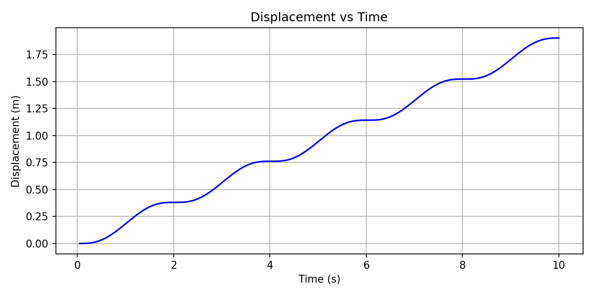

# 实验一：机器人末端轨迹实验

## 概述

本实验以绘制五角星轨迹为例，完成机械臂末端在笛卡尔空间的轨迹规划、数值差分求速度/加速度、逐点逆运动学求解，并导出供仿真使用的关节轨迹（CSV）。实现核心见 `src/runner/research1.py`，机器人模型与工具位于 `src/utils/robot_utils.py`。

---

## 一、机械臂建模

本项目基于自定义xml的六自由度机械臂进行建模（DH 参数）。
### 实现要点：

- `Robot` 类（`src/utils/robot_utils.py`）的构造接受三组数组（link offsets、link lengths、twist angles）；在配置中使用键 `b`、`a`、`alpha` 分别对应。内部单位为米和弧度，配置中若使用度表示会在脚本中转换为弧度。
- `fk(q)`：输入长度为 6 的关节角（弧度），返回 4×4 的齐次变换矩阵（末端位姿）。
- `parse_robot_xml(xml_path)`：如使用 XML 导入，返回 DH 参数和（可选）`JVInitial`（若存在）用于初始化关节角。

调试提示：若 XML 中 `JVInitial` 不满足长度或单位不一致，脚本会回退到配置文件中的 `q0_deg` 并打印警告；建议启用 DEBUG 日志以获取加载信息。

下图为本实验使用的机器人 DH 参数表（b: 链节偏移，a: 连杆长度，alpha: 扭转角；单位已在表头说明）：

<div align="center">


**图 1：实验中使用的机器人 DH 参数表**

</div>

---

## 二、五角星关键点选取

五角星由其外接的正五边形的五个顶点决定。顶点在单位圆上的极角为

$$
\theta = k \cdot \frac{2\pi}{5},\quad k=0,1,2,3,4.
$$

在配置中，`via_points` 应为 5×2 的数组或等价的列表（每个元素为 `[x, y]`，单位为米）。脚本按照顺序 1 → 3 → 5 → 2 → 4 → 1 连成闭合五角星路径。建议先用简单绘图或打印验证顶点顺序与坐标范围。

---

## 三、二维轨迹插值

- 使用五次多项式混合函数（quintic）进行段内插值：

$$
s(t)=6t^5-15t^4+10t^3,\quad t\in[0,1].
$$

- `tpoly_segment(p_0,p_f,N)`：对起点 `p_0` 和终点 `p_f` 生成 N 个采样点（返回形状为 $(N,2)$ 的数组）。
- `mtraj_tpoly(via,samples_per_segment)`：对五个顶点依次生成插值段并拼接成闭合轨迹（包含从最后顶点回到起点的段）。
- 注意采样与时间对齐：最终样本数由 `samples_per_segment` 和顶点数决定；时间向量依据 `dt` 构建，绘图与差分时需注意数组长度和索引对齐。

---

## 四、数值差分（位移/速度/加速度）

### 数值差分实现要点：

- 弧长差分：对于相邻位置 $(x_i,y_i)$，段长

$$
\Delta s_i=\sqrt{(x_{i+1}-x_i)^2+(y_{i+1}-y_i)^2}.
$$

- 位移（累积弧长）通过累积和得到并在起始处插入 0；长度与位置样本一致。
- 速度通过位移差分除以时间间隔计算，长度为 $N-1$；加速度为速度差分除以时间间隔，长度为 $N-2$。
- 绘图提示：速度/加速度与位置时间轴存在相位差，绘制时应相应处理或采用中点对齐。

### 时程曲线示例图

下列为实验生成的示例时程曲（横轴为时间，单位：秒）：

<div align="center">



**图 2：位移（Displacement） vs 时间**

</div>

<div align="center">


**图 3：速度（Speed） vs 时间**

</div>

<div align="center">


**图 4：加速度（Acceleration） vs 时间**

</div>

---

## 五、逆运动学求解

### 实现要点：

- 对每个轨迹点构造目标末端位姿：位置为 $(x,y,z)$（$z$ 来自配置 `end_effector_z`），姿态由常数旋转矩阵 $R_{\text{target}}$ 指定。
- 姿态误差通过角轴表示计算：若 $R$ 为误差旋转矩阵，则

$$
\cos\theta=\frac{\operatorname{trace}(R)-1}{2},\quad
\mathbf{u}=\frac{1}{2\sin\theta}\begin{bmatrix}R_{32}-R_{23}\\R_{13}-R_{31}\\R_{21}-R_{12}\end{bmatrix},
$$

返回的姿态误差为 $\mathbf{u}\,\theta$。

- 残差向量由位置误差（3）、姿态误差（3）和连续性正则项（6）拼接而成，传给 `scipy.optimize.least_squares` 求解。连续性正则项形式为

$$
\text{reg}=w_{\text{reg}}(\mathbf{q}-\mathbf{q}_{\text{prev}}).
$$

- 为提高鲁棒性，采用上一时刻解作为初值；若求解失败或抛出异常，脚本会记录警告并回退到上一时刻的解以保证输出完整性。

---

## 六、导出与仿真

- CSV 导出规范：
  - 第一列：时间（秒），保留两位小数；
  - 随后每个关节占三列：角度（度，6 位小数）、0、0；共 19 列；
  - 导出前会将关节角从弧度转换为度，并规约到 $(-180,180]$ 区间以避免角度跳变。
- 文件写入：脚本会在写文件前确保输出目录存在，逐行写入 CSV。如需更严格的原子性，可先写临时文件再重命名。

### 曲线图（位移/速度/加速度）

脚本会将位移、速度、加速度相对于时间的时程曲线导出为 PNG 文件，默认保存在与 CSV 相同的输出目录（`data/output` 或 `output_path` 所在目录）。配置项 `plots` 可用于自定义每个图像的输出路径：

**新增：DH 参数表导出**

脚本现在支持将机器人 DH 参数导出为一张 PNG 表格（列：`b (m)`, `a (m)`, `alpha (rad)`）。生成的表格已美化（表头着色、数值居中、边框与合适字体）。配置项如下：

```yaml
save_dh_table: true
dh_table_path: data/output/dh_table.png
```

当 `save_dh_table` 为 `true` 并且系统可用 matplotlib 时，程序会在初始化阶段把 DH 参数表保存到 `dh_table_path`。


示例（`configs/research1_config.yaml` 中新增）：

```yaml
plots:
  displacement: data/output/displacement.png
  speed: data/output/speed.png
  acceleration: data/output/acceleration.png
save_plots: true  # 可选，设置为 false 则不保存图像
```

在保存图像时脚本会根据时间向量自动对齐横轴：
- 位移使用时间向量 `t`（长度 N），
- 速度使用 `t[1:]`（长度 N-1），
- 加速度使用 `t[2:]`（长度 N-2）。

### 仿真演示视频

下面为关节轨迹的仿真演示（如预览器不支持内嵌视频，请直接打开 `docs/source/research1.mp4`）：

<video controls width="640" poster="./source/research1_poster.png">
  <source src="./source/research1.mp4" type="video/mp4">
  您的浏览器不支持视频标签，请直接打开 `docs/source/research1.mp4`。
</video>

---

## 实现细节与调试建议

- 日志：默认 INFO 级别；设置为 DEBUG 可打印每步 IK 的残差及求解状态。
- 常见问题与建议：
  - IK 不收敛：增大 `ik.max_nfev`、调整 `ik.reg_weight` 或改进初始角 `q0_deg`；
  - 波形不平滑：增加 `samples_per_segment` 或调整 `dt`；
  - 性能瓶颈：逐点串行 IK 是主要耗时点，可考虑并行化或采用解析 IK。

---


