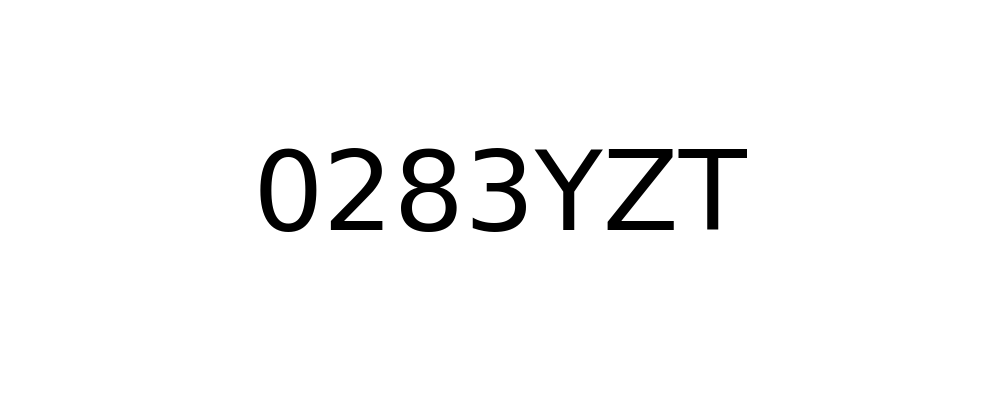
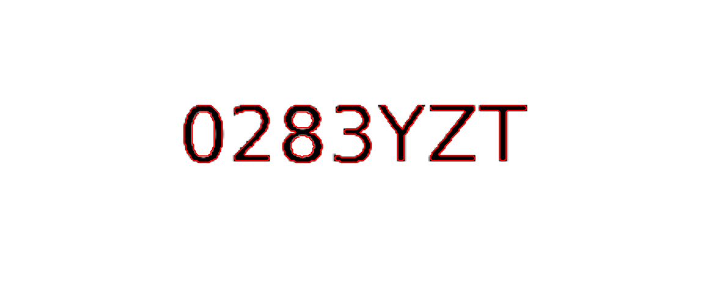
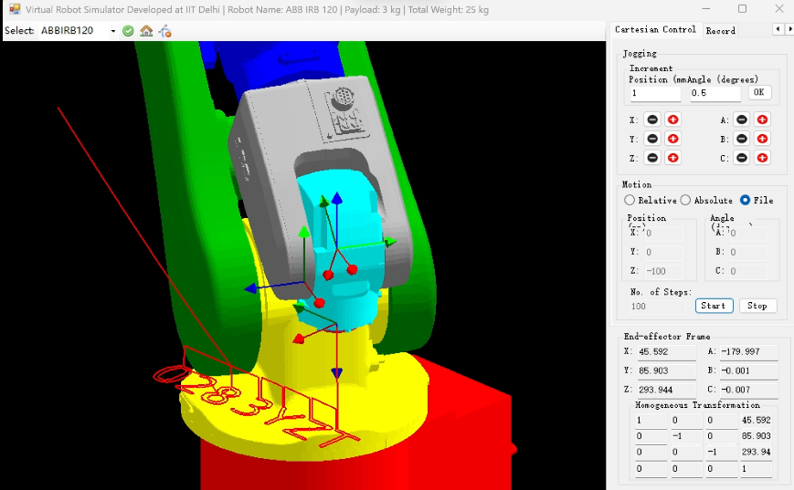

# 实验二：机器人虚拟仿真实验（基于字符轮廓）

## 概述

本实验旨在将字符轮廓转化为机械臂可执行的轨迹，并在 Virtual robots 中验证。依旧采用 ABBIRB120 作为仿真机器人，并使用 `src/runner/research2.py` 实现从文字渲染到轨迹导出的完整流程。

---

## 一、选取与选取理由

- 工作设定：在垂直于 Z 轴的平面上执行雕刻/喷涂等平面任务，便于将三维问题转化为二维轨迹规划与仿真；
- 机械臂：选择 ABBIRB120，工作范围与控制特性适合平面作业，方便末端安装常见工具；
- 工作区示例：平面距 XY 平面 400 mm，示例工作区 x ∈ [302,402] mm，y ∈ [0,100] mm（在 Virtual robots 中更稳定，便于调试）。

---

## 二、关键点提取（实现方法概述）

流程摘要（实现于 `src/runner/research2.py`）：

1. 文本渲染：用 Matplotlib 渲染目标字符到画布（可通过 `font_path` 指定字体以支持中文）；
2. 二值化：若未显式设置阈值，使用内置的 Otsu-like 算法自动估计；可选形态学处理（`morph_open`）用于去噪；
3. 轮廓提取：可选 `moore`（像素级追踪）、`find_contours`（skimage 亚像素）或 `textpath`（矢量轮廓）；
4. 后处理：孔/外轮廓匹配、横向聚类（保证字形顺序）、去噪与下采样（`contour_decimate`）以得到稳定的通过点序列。

实务提示：优先使用 `textpath`（若可用）以取得更稳定的字形分割；对中文或复杂字体请确保 `font_path` 指向支持该字符集的字体文件。

---

## 三、笛卡尔空间轨迹规划（XY 平面）

- 将 2D 轮廓点映射到工作平面并补上固定高度 `z_height`，作为末端目标位置：

  $$\mathbf{p}_i^{3D} = (x_i,\; y_i,\; z_{\mathrm{height}})^{\top}.$$ 

- 段内采用五次多项式插值（quintic blending）产生光滑位置时程，以保证位置、速度与加速度连续：

  $$s(t)=6t^5-15t^4+10t^3,\quad t\in[0,1],$$

  插值位置可写为

  $$\mathbf{p}(t)=\mathbf{p}_0 + (\mathbf{p}_f-\mathbf{p}_0)\,s(t).$$

- 轮廓间采用抬升（lifted travel）策略，避免绘制时跨段连线。令

  $$z_{\mathrm{up}}=z_{\mathrm{height}}+\mathrm{travel\_z},$$

  则连接步骤为：上升到 $(x_{\mathrm{from}},y_{\mathrm{from}},z_{\mathrm{up}})$ → 在高位平移至 $(x_{\mathrm{to}},y_{\mathrm{to}},z_{\mathrm{up}})$ → 下降到绘制高度 $(x_{\mathrm{to}},y_{\mathrm{to}},z_{\mathrm{height}})$。

- 起始/结束采用“温和到位”（gentle approach）：在接近首个绘制点时先到达一个中间到达高度

  $$z_{\mathrm{arrival}}=z_{\mathrm{height}}+\mathrm{initial\_arrival\_margin},$$

  然后再做小幅下降以减少冲击。参数（如 `interp_density`, `max_travel_points`）可在 YAML 中调整以平衡精度与计算/执行成本。

---

## 四、导出与仿真验证

- 导出格式：CSV，行格式为 `(x, y, z, 0, 0, 0)`（脚本会格式化数值以兼容仿真器）；
- 验证流程：将 CSV 导入 Virtual robots 或 Roboanalyzer，执行 IK/正运动学并与原始轮廓比较；
- 常见问题排查：若出现不可达或跳跃，优先检查 `font_path`、`render_dpi`、`threshold`、`z_height`、`travel_z` 与工作区设置。

### 中间渲染输出（示例与说明）

下图展示 <code>src/runner/research2.py</code> 在处理流程中可选保存的中间产物（由配置项 <code>save_images</code> / <code>images.*</code> 控制）。示例图片位于 <code>docs/picture/research2/</code>，用于在导出 CSV 前直观验证各步骤效果与参数设置。

<figure style="text-align:center; margin:18px 0;">
  
  <figcaption style="margin-top:8px; color:#333; font-size:0.95em;"><strong>渲染图（rendered）</strong> — 由 Matplotlib 的文本渲染（或 <code>TextPath</code>）生成的像素化图像，用于观察字符在像素空间的形状与笔画宽度（受 <code>font_path</code>、<code>render_dpi</code>、<code>image_size</code> 影响）。</figcaption>
</figure>

<figure style="text-align:center; margin:18px 0;">
  
  <figcaption style="margin-top:8px; color:#333; font-size:0.95em;"><strong>二值化掩码（binary）</strong> — 对渲染图应用阈值（或 Otsu-like 自动估计）并可选形态学开运算得到的二值图，用于去除噪点、闭合孔洞并保证边界连通性（受 <code>threshold</code>、<code>morph_open</code> 等参数影响）。</figcaption>
</figure>

<figure style="text-align:center; margin:18px 0;">
  
  <figcaption style="margin-top:8px; color:#333; font-size:0.95em;"><strong>轮廓提取与叠加（contours）</strong> — 基于 <code>boundary_method</code>（<code>moore</code>/<code>find_contours</code>/<code>textpath</code>）提取并经过孔/外轮廓配对、横向聚类与下采样（<code>contour_decimate</code>），以线条形式叠加检验轮廓顺序与点数质量。</figcaption>
</figure>

<figure style="text-align:center; margin:18px 0;">
  
  <figcaption style="margin-top:8px; color:#333; font-size:0.95em;"><strong>轨迹预览（preview）</strong> — 将最终轨迹（包含抬升 <code>travel_z</code> 与温和到位动作）叠加在渲染背景上，便于在导出 CSV 前检查 <code>z_height</code>、<code>travel_z</code>、<code>interp_density</code> 等参数对轨迹的影响。</figcaption>
</figure>

注：若需保存或调整这些中间图像，请在配置文件中启用 <code>save_images: true</code> 并在 <code>images</code> 下设置相应的输出路径。

---

## 五、配置示例（常用键）

  <table style="border-collapse:collapse; width:80%; max-width:900px; font-family:'Noto Sans SC', 'Helvetica Neue', Arial; text-align:center;">
    <thead>
      <tr style="background:#f7fafc;">
        <th style="padding:10px 14px; border:1px solid #e6e6e6;">键</th>
        <th style="padding:10px 14px; border:1px solid #e6e6e6; font-family:'Courier New', monospace;">类型</th>
        <th style="padding:10px 14px; border:1px solid #e6e6e6;">说明</th>
      </tr>
    </thead>
    <tbody>
      <tr><td style="padding:10px 14px; border:1px solid #e6e6e6;">`text_string`</td><td style="padding:10px 14px; border:1px solid #e6e6e6;">str</td><td style="padding:10px 14px; border:1px solid #e6e6e6;">要渲染的文本，例如 `"0283YZT"`</td></tr>
      <tr><td style="padding:10px 14px; border:1px solid #e6e6e6;">`font_path`</td><td style="padding:10px 14px; border:1px solid #e6e6e6;">str</td><td style="padding:10px 14px; border:1px solid #e6e6e6;">字体文件（建议指定以支持中文）</td></tr>
      <tr><td style="padding:10px 14px; border:1px solid #e6e6e6;">`render_dpi`</td><td style="padding:10px 14px; border:1px solid #e6e6e6;">int</td><td style="padding:10px 14px; border:1px solid #e6e6e6;">渲染 DPI，用于控制像素精度</td></tr>
      <tr><td style="padding:10px 14px; border:1px solid #e6e6e6;">`image_size`</td><td style="padding:10px 14px; border:1px solid #e6e6e6;">[w,h]</td><td style="padding:10px 14px; border:1px solid #e6e6e6;">渲染分辨率（像素）</td></tr>
      <tr><td style="padding:10px 14px; border:1px solid #e6e6e6;">`downscale`</td><td style="padding:10px 14px; border:1px solid #e6e6e6;">float</td><td style="padding:10px 14px; border:1px solid #e6e6e6;">渲染后缩放以控制点数（<1 放大像素）</td></tr>
      <tr><td style="padding:10px 14px; border:1px solid #e6e6e6;">`boundary_method`</td><td style="padding:10px 14px; border:1px solid #e6e6e6;">str</td><td style="padding:10px 14px; border:1px solid #e6e6e6;">`moore`/`find_contours`/`textpath`</td></tr>
      <tr><td style="padding:10px 14px; border:1px solid #e6e6e6;">`contour_decimate`</td><td style="padding:10px 14px; border:1px solid #e6e6e6;">int</td><td style="padding:10px 14px; border:1px solid #e6e6e6;">轮廓下采样因子，控制点数</td></tr>
      <tr><td style="padding:10px 14px; border:1px solid #e6e6e6;">`z_height`</td><td style="padding:10px 14px; border:1px solid #e6e6e6;">float</td><td style="padding:10px 14px; border:1px solid #e6e6e6;">绘制高度（同单位）</td></tr>
      <tr><td style="padding:10px 14px; border:1px solid #e6e6e6;">`travel_z`</td><td style="padding:10px 14px; border:1px solid #e6e6e6;">float</td><td style="padding:10px 14px; border:1px solid #e6e6e6;">抬升高度（安全余量）</td></tr>
      <tr><td style="padding:10px 14px; border:1px solid #e6e6e6;">`output_path`</td><td style="padding:10px 14px; border:1px solid #e6e6e6;">str</td><td style="padding:10px 14px; border:1px solid #e6e6e6;">导出 CSV 路径</td></tr>
    </tbody>
  </table>

示例运行命令：

`python src/runner/research2.py --config configs/research2_config.yaml`

示例运行命令：

`python src/runner/research2.py --config configs/research2_config.yaml`

---

## 六、实验结果与结论

- 本方法在合理参数下能稳定生成并仿真字符轨迹；虚拟仿真可用于验证可达性与轨迹连续性；
- 在转入真实机械臂执行前，务必增加速度/加速度限制、碰撞检测和局部手动校验（尤其是高曲率或窄缝区域）。

  
  
<strong>示例仿真结果（Research2）</strong> — 以静态截图展示仿真回放中的关键帧用于结果验证。

---

